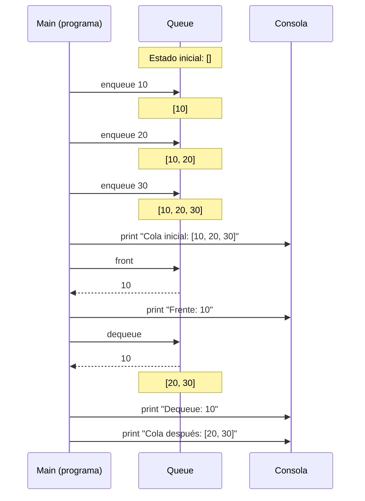

# EDA II – Práctica 0: Queue en Python

Alumnos:
- Rick Sánchez
- Morty Smith

---

## Objetivo
El objetivo de esta práctica es **comprender, diseñar e implementar** la estructura de datos **Queue (cola)** en Python. Además, se busca analizar su comportamiento, operaciones principales, complejidad computacional y aplicaciones prácticas.

---

## Descripción
Una **Queue** es una estructura de datos lineal basada en el principio **FIFO (First In, First Out)**: el primer elemento que entra es el primero que sale. Sus principales aplicaciones incluyen:
- Procesar tareas en orden de llegada (impresoras, colas de procesos en un sistema operativo).
- Modelar colas reales (bancos, restaurantes, servicios).
- Implementar algoritmos como **BFS (Breadth-First Search)** en grafos.

En esta práctica se implementa una versión sencilla de `Queue` usando listas en Python.

---

## Investigación

### ¿Por qué `pop(0)` es O(n)?
En Python, las listas están implementadas como arreglos dinámicos. Cuando se elimina el primer elemento con `pop(0)`, todos los elementos restantes deben desplazarse una posición hacia la izquierda para llenar el hueco, lo cual requiere O(n) operaciones.

### Alternativas eficientes
- **`collections.deque`**: Implementa una cola de doble extremo con operaciones O(1) tanto para agregar como para remover en ambos extremos. Internamente usa una lista doblemente enlazada de bloques.
- **Cola circular con arreglo**: Usa dos índices (frente y final) que avanzan de forma circular, evitando el desplazamiento de elementos.
- **Lista enlazada**: Mantiene referencias al primer y último nodo, permitiendo inserción y eliminación en O(1).

### Aplicaciones de Queue en algoritmos
- **BFS (Breadth-First Search)**: Recorre grafos nivel por nivel usando una cola para procesar nodos en orden de descubrimiento.
- **Scheduling de procesos**: Los sistemas operativos usan colas para manejar procesos en espera (Round Robin, FIFO scheduling).
- **Buffer de datos**: En comunicaciones, las colas manejan paquetes que llegan más rápido de lo que se pueden procesar.

---

## Diagrama de flujo


---

## Implementación

### Operaciones principales
- `enqueue(item)`: insertar un elemento al final de la cola.
- `dequeue()`: remover y devolver el primer elemento de la cola.
- `front()`: consultar el primer elemento sin removerlo.
- `is_empty()`: verificar si la cola está vacía.
- `size()`: obtener el número de elementos.

### Código en Python
El código completo se encuentra en `src/queue.py`. A continuación se muestran las operaciones principales:

```python
def enqueue(self, item):
    self.data.append(item)  # Agrega al final

def dequeue(self):
    if self.is_empty():
        raise IndexError("Queue is empty")
    return self.data.pop(0)  # Remueve del frente

def front(self):
    if self.is_empty():
        raise IndexError("Queue is empty")
    return self.data[0]  # Consulta sin remover
```

---

## Resultados
Ejecución esperada:

```text
Cola inicial: [10, 20, 30]
Dequeue: 10
Cola después: [20, 30]
Todas las validaciones pasaron correctamente.
```

---

## Complejidad
- `enqueue`: O(1).
- `dequeue`: O(n), debido al corrimiento de elementos al usar `pop(0)`.
- `front`, `is_empty`, `size`: O(1).
- Memoria: O(n).

> Nota: En implementaciones más avanzadas se puede optimizar `dequeue` para que también sea O(1), usando índices o estructuras enlazadas.

---

## Conclusiones

### Rick Sánchez
- Usar `pop(0)` en una lista es una decisión de diseño terriblemente ineficiente. O(n) para un simple dequeue es inaceptable cuando `collections.deque` existe y ofrece O(1) en ambas operaciones. La implementación funciona, pero no escala.
- El análisis de complejidad me confirmó que siempre hay que pensar en el peor caso. Una cola con millones de elementos sería un desastre con esta implementación básica.
- Investigando encontré que las colas circulares son elegantes: usan aritmética modular para reciclar espacio sin mover elementos. Es la solución obvia que cualquier científico competente implementaría.

### Morty Smith
- Al principio no entendía bien la diferencia entre una pila y una cola, pero con esta práctica me quedó claro: en la cola el primero que llega es el primero que sale, como cuando haces fila para comprar algo.
- Me costó entender por qué `pop(0)` es lento, pero el diagrama me ayudó a visualizar cómo todos los elementos se tienen que mover cuando quitas el primero. Es como cuando la primera persona de una fila se va y todos dan un paso adelante.
- Me gustó ver que las colas se usan en cosas reales como BFS para recorrer grafos. Eso me motiva a seguir aprendiendo estructuras de datos.

---

## Cómo ejecutar
```bash
python src/queue.py
```

---

## Referencias

- Cormen, T. H., Leiserson, C. E., Rivest, R. L., & Stein, C. (2009). *Introduction to Algorithms* (3rd ed.). MIT Press.
- Python Software Foundation. (2024). *collections — Container datatypes*. https://docs.python.org/3/library/collections.html#collections.deque
- GeeksforGeeks. (2024). *Queue Data Structure*. https://www.geeksforgeeks.org/queue-data-structure/
- OpenAI. (2024). ChatGPT [Modelo de lenguaje]. Utilizado para aclarar dudas sobre la complejidad de `pop(0)` en listas de Python. https://chat.openai.com/
