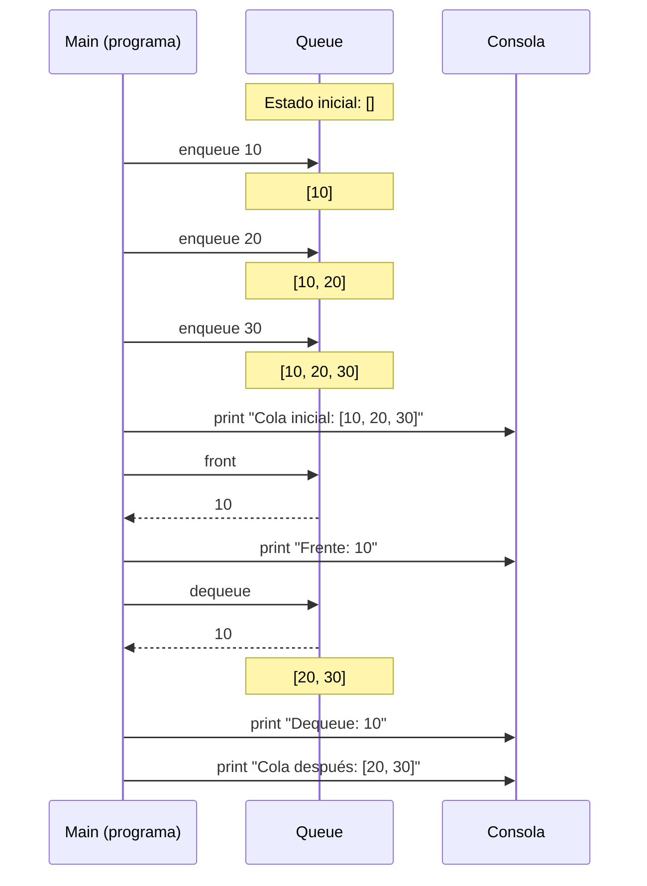

# EDA II – Práctica 0: Queue en Python

Alumnos:
- Daniel Vargas

---

## Objetivo
El objetivo de esta práctica es **comprender, diseñar e implementar** la estructura de datos **Queue (cola)** en Python. Además, se busca analizar su comportamiento, operaciones principales, complejidad computacional y aplicaciones prácticas.

---

## Descripción
Una **Queue** es una estructura de datos lineal basada en el principio **FIFO (First In, First Out)**: el primer elemento que entra es el primero que sale. Sus principales aplicaciones incluyen:
- Procesar tareas en orden de llegada (impresoras, colas de procesos en un sistema operativo).
- Modelar colas reales (bancos, restaurantes, servicios).
- Implementar algoritmos como **BFS (Breadth-First Search)** en grafos.

En esta práctica se implementa una versión sencilla de `Queue` usando listas en Python.

---

## Diagrama (Mermaid)


---

## Implementación

### Operaciones principales
- `enqueue(item)`: insertar un elemento al final de la cola.
- `dequeue()`: remover y devolver el primer elemento de la cola.
- `front()`: consultar el primer elemento sin removerlo.
- `is_empty()`: verificar si la cola está vacía.
- `size()`: obtener el número de elementos.

### Código en Python (simplificado)
```python
# File: src/queue.py

class Queue:
    def __init__(self):
        self.data = []

    def is_empty(self):
        return len(self.data) == 0

    def size(self):
        return len(self.data)

    def enqueue(self, item):
        self.data.append(item)

    def dequeue(self):
        if self.is_empty():
            raise IndexError("Queue is empty")
        return self.data.pop(0)

    def front(self):
        if self.is_empty():
            raise IndexError("Queue is empty")
        return self.data[0]

if __name__ == "__main__":
    q = Queue()
    q.enqueue(10)
    q.enqueue(20)
    q.enqueue(30)
    print("Cola inicial:", q.data)
    print("Frente:", q.front())
    print("Dequeue:", q.dequeue())
    print("Cola después:", q.data)
```

---

## Resultados
Ejecución esperada:

```text
Cola inicial: [10, 20, 30]
Frente: 10
Dequeue: 10
Cola después: [20, 30]
```

---

## Complejidad
- `enqueue`: O(1).
- `dequeue`: O(n), debido al corrimiento de elementos al usar `pop(0)`.
- `front`, `is_empty`, `size`: O(1).
- Memoria: O(n).

> Nota: En implementaciones más avanzadas se puede optimizar `dequeue` para que también sea O(1), usando índices o estructuras enlazadas.

---

## Conclusiones
Durante la práctica aprendí que:
- La cola (Queue) es una estructura muy importante porque se usa en muchos problemas reales, como la cola de procesos de un sistema operativo (donde se atienden tareas en orden), en las colas de impresión (para que los documentos se impriman en el orden en que llegan)
- Con la implementación sencilla en Python entendí mejor cómo funciona el orden FIFO, ya que se ve claramente quién entra primero y quién sale primero, igual que en una fila de personas en el banco.
- Me di cuenta de que enqueue es rápido porque Python agrega al final de la lista en O(1), mientras que dequeue es más costoso porque al quitar el primer elemento la lista debe recorrer todos los demás hacia la izquierda, lo cual es O(n). Esto me motiva a investigar implementaciones más eficientes como colas circulares o enlazadas, donde ambas operaciones son O(1).
- Al programar la cola pude reforzar lo que son las estructuras lineales y cómo se aplican en la práctica, no solo en teoría.

---

## Cómo ejecutar
```bash
python src/queue.py
```

---
